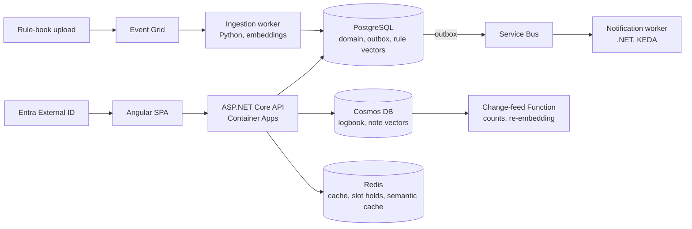

# RangeDesk

A multi-tenant operations platform for shooting clubs: lane and equipment reservations, member shooting logbooks, notifications, and a RAG-based rules assistant that cites its sources.

> **Status:** early development (Block 0, walking skeleton). RangeDesk is a hands-on learning project, not a production product. All data is synthetic.

## Purpose

RangeDesk is a reference project for building and operating a cloud-native system end to end: design, implementation, testing, CI/CD, infrastructure as code, deployment, observability and failure handling. The domain comes from my own sport, which keeps the focus on engineering rather than requirements discovery.

The scope is aligned with the Microsoft AI-200 syllabus (containers, data for AI, messaging, security, observability), so each topic is exercised in a realistic system rather than an isolated lab.

## Features (MVP)

- Time-slot reservations for lanes and equipment, with a waitlist; double booking is prevented by a database constraint
- Multi-tenancy: one person can be a member of one club and an administrator of another
- Digital shooting logbook: members log sessions, range officers confirm them, and confirmed sessions from the last 12 months are counted
- Notifications for confirmations, cancellations and reminders
- Rules assistant (RAG) that answers questions and cites the underlying paragraph

Out of scope: payments, mobile app, real member data, UI polish.

## Architecture



The business application is .NET. Only the ingestion worker (chunking and embeddings) is Python, in line with the AI tooling ecosystem.

## Tech stack

| Area | Choice | Rationale |
|---|---|---|
| Backend | ASP.NET Core Web API, EF Core | Primary stack |
| Frontend | Angular | Deliberately minimal |
| Relational data | PostgreSQL + pgvector | Exclusion constraints for bookings; vector search for the assistant |
| Documents | Cosmos DB for NoSQL | Logbook entries vary by discipline; change feed |
| Cache | Redis | Availability cache, slot holds, semantic cache |
| Messaging | Service Bus, Event Grid, Azure Functions | Transactional outbox, idempotent consumers |
| AI | Azure OpenAI (Microsoft Foundry), Python worker | Embeddings and cited answers |
| Identity | Entra External ID | Authentication; club roles are managed in the app |
| Hosting | Azure Container Apps, Container Registry | Revisions, traffic splitting, KEDA scaling |
| Infra and delivery | Bicep, GitHub Actions (OIDC) | Everything as code, no secrets in the repo |
| Observability | OpenTelemetry, Application Insights, KQL | Distributed tracing across services |
| Tests | xUnit, Testcontainers | Integration tests against real PostgreSQL |

## Roadmap

Each block ends deployed, tested and documented.

- [ ] **Block 0:** walking skeleton and pipeline (API, Angular shell, PostgreSQL, CI/CD, Bicep, seed and teardown scripts)
- [ ] **Block 1:** domain, data, identity, tenant isolation
- [ ] **Block 2:** containers (revisions, traffic splitting, KEDA)
- [ ] **Block 3:** data for AI (Cosmos DB, RAG with pgvector, Redis, evaluation set)
- [ ] **Block 4:** messaging and failure handling (outbox, idempotency, Event Grid, Functions)
- [ ] **Block 5:** security and observability (Key Vault, App Configuration, OpenTelemetry, KQL)
- [ ] **Block 6:** Python consolidation
- [ ] **Operations drill:** deploy with data, rollback, restore, dependency outage, expand/contract migration

## Working approach

- **Spec-driven:** each increment starts as a short spec in `docs/specs/` (goal, acceptance criteria, non-goals).
- **AI-assisted, human-owned:** AI agents handle boilerplate; core concepts and tests are written by hand, as the tests serve as the executable specification.
- **Documented decisions:** ADRs in `docs/adr/`, architecture in `docs/arc42/`.
- **Trunk-based delivery:** short-lived branches, pull requests with CI checks, squash merge (see `docs/ci-cd.md`).
- **Cloud on demand:** the Azure environment is provisioned from Bicep when needed and torn down afterwards to control cost.

## Repository structure (planned)

```
range-desk/
├── src/              # API, Angular app, workers, Functions
├── tests/            # unit and integration tests
├── infra/            # Bicep templates
├── scripts/          # seed, dump and teardown
├── docs/             # specs, adr, arc42
└── .github/workflows/
```

## Getting started

Setup instructions will be added with Block 0. Prerequisites: .NET SDK, Node.js (LTS), Docker, Python 3.12+, Azure CLI.

## Data and rules

- Synthetic data only; no real member data.
- Published rule books are used for private learning only; no public demo without permission from the rights holder.

## License

Not yet decided; all rights reserved for now.
